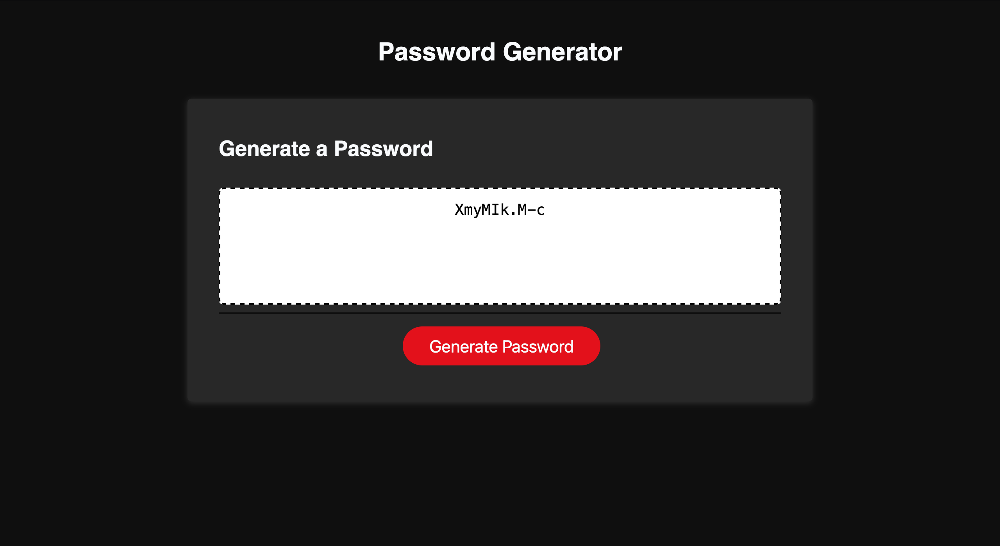

# Password-Generator

[Link to page](https://drgunbot.github.io/Password-Generator/)

## This code generates a random password based on user input. The user is prompted to select the length of the password (between 10 and 64 characters), and whether to include special characters, numeric characters, lowercase characters, and uppercase characters.

The code defines four arrays of special characters, numeric characters, lowercase characters, and uppercase characters that can be included in the password.

The getPasswordOptions function prompts the user for the password options and returns an object containing the user's selections. If the user does not select at least one type of character, the function alerts the user and ends.

The getRandom function returns a random element from an array.

The generatePassword function calls getPasswordOptions to get the user's selections, and creates an array of possible characters to include in the password based on the user's selections. It then uses the getRandom function to select random elements from the possible characters array to generate the password. If the user's input is not valid, the function ends without generating a password.
